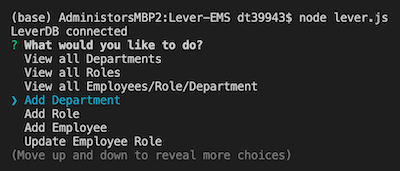

  # Lever Employee Management System (EMS)
  
  
## Description 
  Lever is an employee management system that lets users view departments, roles and employees in their company. Add, update and view departments, roles and employees all with a few keystrokes in the terminal. Lever is primarily a back-end application using MySQL and Node.js. 

  Video Walkthrough  
    

  CLI
   

  ## Table of Contents
  * [Installation](#installation)
  * [Usage](#usage)
  * [License](#license)
  * [Contributing](#contributing)
  * [Test Instructions](#test-instructions)
  * [Questions](#questions)

  ## Installation
    
    1. Download the Lever-EMS repository locally to your computer. Open the Lever-EMS directory in your workspace (e.g. Visual Studio Code).
    2. Run npm install in your bash/command line to install npm dependencies (inquirer, mysql, console.table) listed in the package.json file.
    3. In the Lever-EMS directory, there are 2 files - schema.sql and seeds.sql. Use an SQL GUI (e.g. MySQLWorkbench) to run the schema.sql file first followed by seeds.sql.

  ## Usage
      
    1. Follow all installation steps before running the application. To run application, invoke with node lever.js in your bash/command line. Ensure that you have changed the password to your own password in the lever.js file. 
    2. Respond to prompts in the command line. 
    3. When adding new departments, employees, roles, or updating employee roles, you can view your changes by selecting "View all ..." in the menu.

  ## License
  MIT (c) Hoang Nguyen   
  See LICENSE for details.

  ## Contributing
  Please check the app's GitHub issue tracker for known issues. Report bugs and requests to GitHub Issues.

  ## Test Instructions
  Install and run the application per instructions above. The terminal should display 'connected as id X' when you have connected to your local database. See video walkthrough for tests you could run to check functionality.

  ## Questions
  For questions, reach out to me here:  
  Github: https://github.com/hngdngng  
  Email: [hoang.d.nguyen@outlook.com](mailto:hoang.d.nguyen@outlook.com)
  